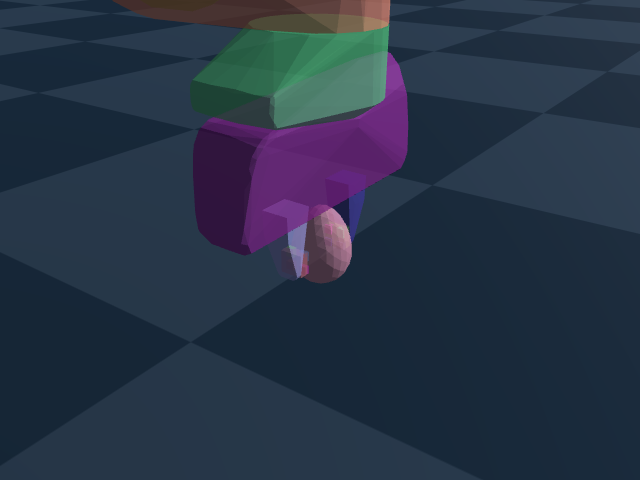

# Scope-specific raw evidence

These files accompany the implementation checkpoint described in
[the progress report](../../docs/PROGRESS_20261009.md). The complete goal remains
active. Numerical tests, physical convergence and performance are separate.

- `cpu.json`, `gpu-direct.json`: CPU and actual sparse CUDA numerical checks.
- `wrench.json`, `gpu-pressure.json`: finite vector/pad traction and device/CPU comparisons.
- `shell-cone-diagnosis.json`, `sliding-wrench.npz`: rejected shell-face cone model replay and quadrature diagnostics.
- `full-pad-convergence.json`/`.csv`: complete full levels 2/3/4 experiment, failed mesh acceptance.
- `recovery-micro.json`/`.csv`: warmed assembled-RHS scope, three >=10-second repeats at each B.
- `grasp-rollout.json`, `grasp-summary.json`, `grasp-contacts.npz`: complete real pose-matched nominal trajectory.
- `grasp.mp4`, `grasp.png`: actual rigid-scene visualization of that trajectory.
- `contacts-*.log`: original accessor/friction test output, including the intentional baseline failure.
- `manifest.json`: sizes, hashes, base commit and evidence acceptance boundary.

The live raw JSON contains diagnostic rates that include verification and
recording. Use its named numerical/physical fields for this scope. Steady live
environment transition throughput requires the separate complete benchmark.

